<p align="center">
  <h1 align="center">📚 NotesHub</h1>
  <p align="center">
    Structured Academic Notes Platform for Mumbai University & MSBTE Students
  </p>
</p>

<p align="center">
  
  
  
  
  
</p>

---

## 📖 About NotesHub

NotesHub is a MERN stack web application that provides structured academic notes categorized by university, semester, and subject. The platform helps students easily browse, preview, and download study materials.

---

## ✨ Features

- 🔐 User Authentication  
- 📜 Terms & Conditions Acceptance  
- 🏫 University-wise Notes Access  
- 📚 Semester & Subject Navigation  
- 📂 File Preview & Download  
- 📞 Contact Support  
- 📱 Responsive UI  

---

## 🧰 Tech Stack

### Frontend
- React.js  
- React Router  
- Custom CSS  

### Backend
- Node.js  
- Express.js  

### Database & Storage
- MongoDB (Authentication Storage)  
- Supabase Storage (Notes Files)  

---


## ⚙️ Environment Variables

Create `.env` file inside backend folder:

```
PORT=8000
SUPABASE_URL=your_supabase_url
SUPABASE_ANON_KEY=your_supabase_key
MAIL_USER=your_email
MAIL_PASS=your_email_password
```

---

## 🌐 API Endpoint

```
GET /api/notes/:university/:semester/:subject
```

---

##  Getting Started

### Clone Repository

```bash
git clone https://github.com/Shahiduddin1710/Notes-Hub-main.git
cd NotesHub
```

---

### Install Dependencies

#### Backend

```bash
cd backend
npm install
```

#### Frontend

```bash
cd frontend
npm install
```

---

### Run Application

#### Start Backend

```bash
npm start
```

#### Start Frontend

```bash
npm start
```

---

---

## 📸 Project Screenshots

<p align="center">

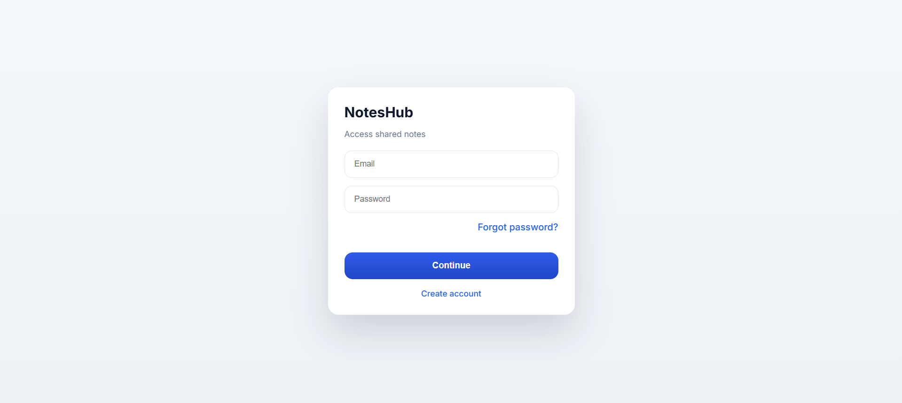
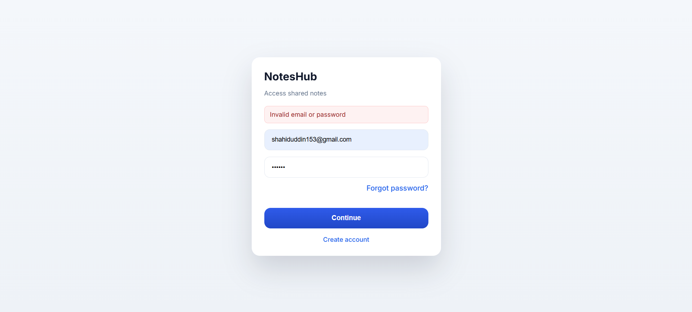


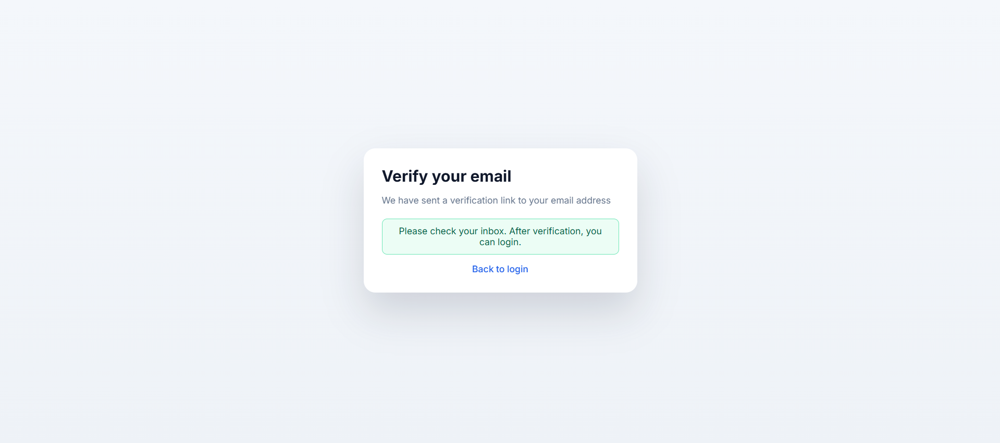

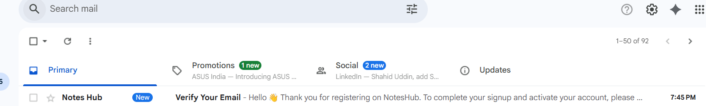
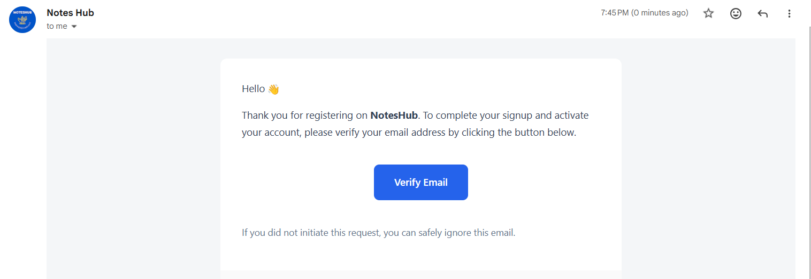

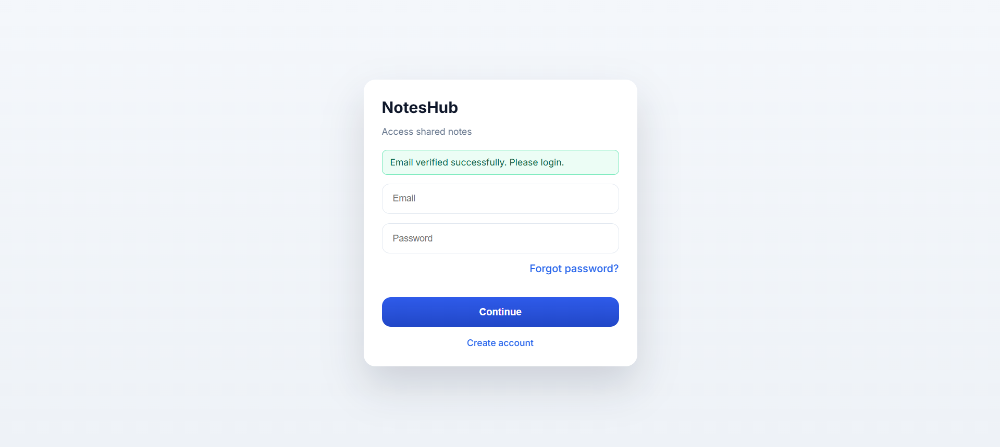
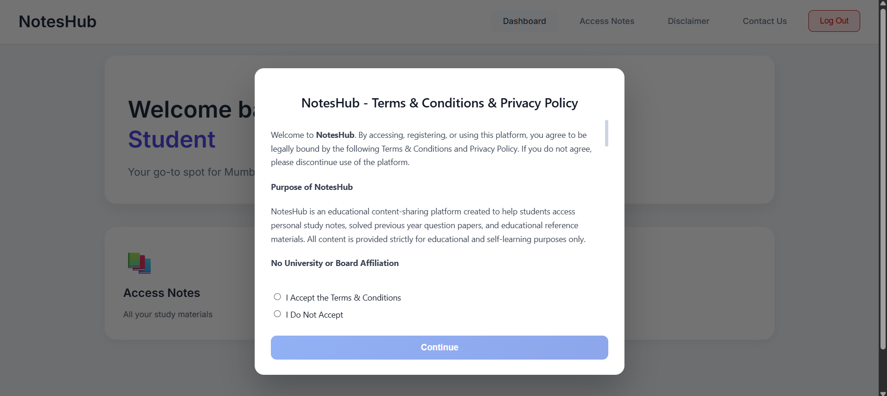

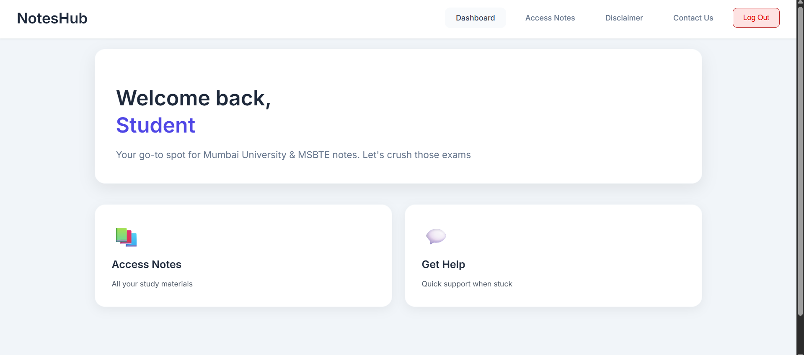
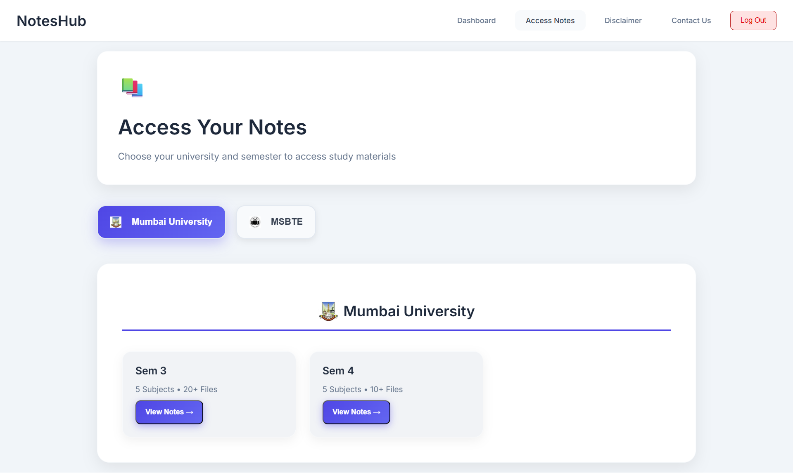

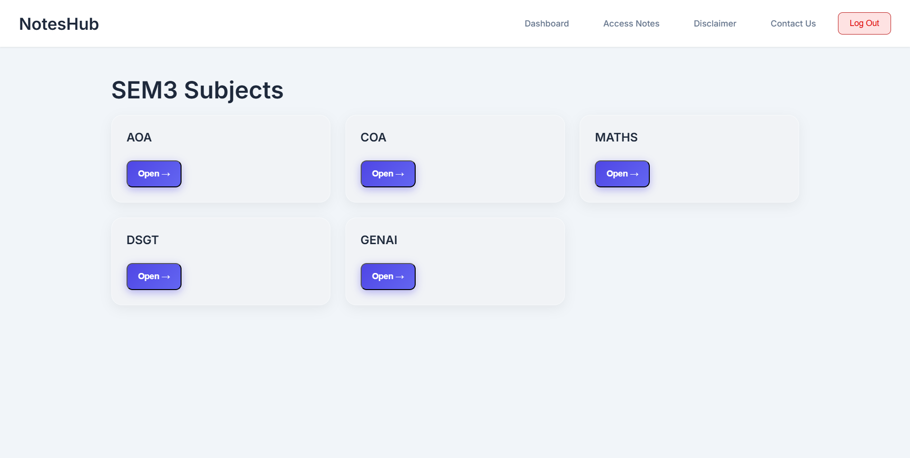
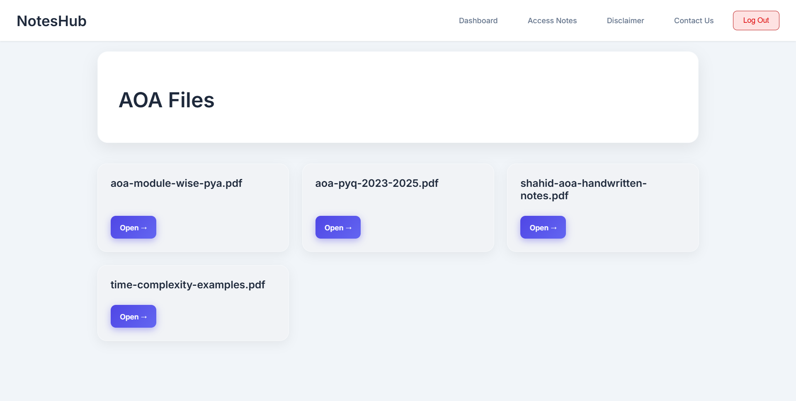

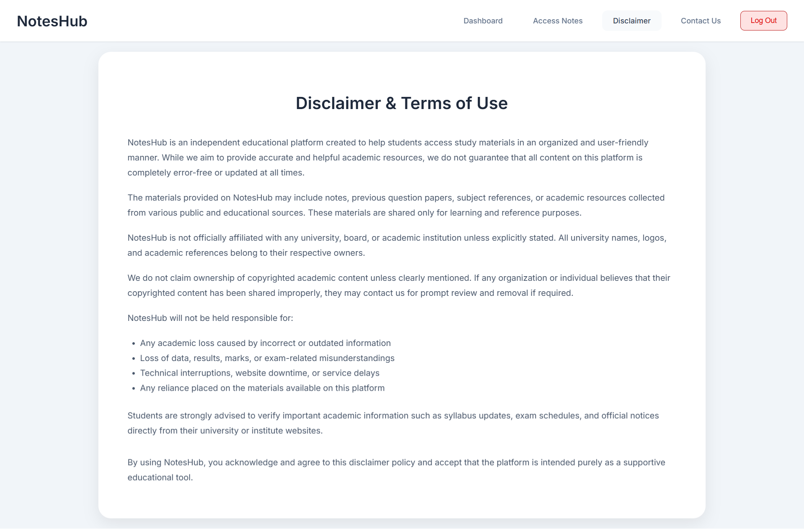
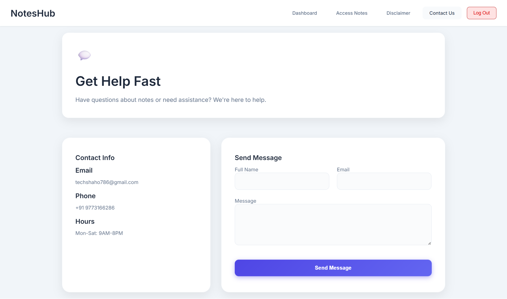

</p>

---


## 🔮 Future Improvements

- Admin Dashboard  
- Notes Upload System  
- Search Functionality  
- Custom Domain Support  

---

---

## 👨‍💻 Author

<p align="center">

<b>Shahiduddin Shaikh (Shaho)</b>  
<br/>
Bachelor of Engineering – Computer Engineering  
<br/>
Vidyavardhini College of Engineering, Vasai

</p>
---


<p align="center">
⭐ If you like this project, consider giving it a star!
</p>
